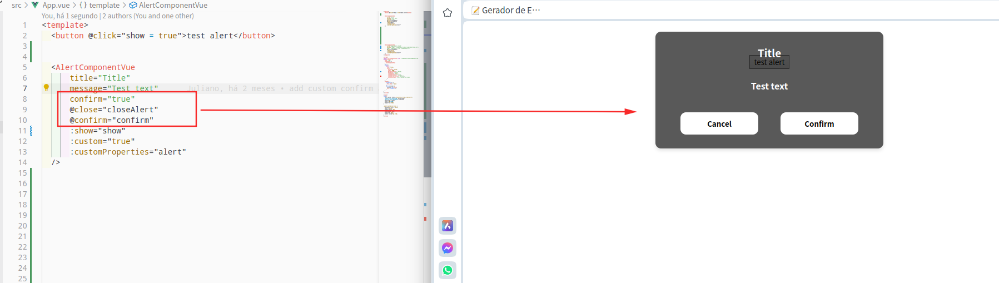
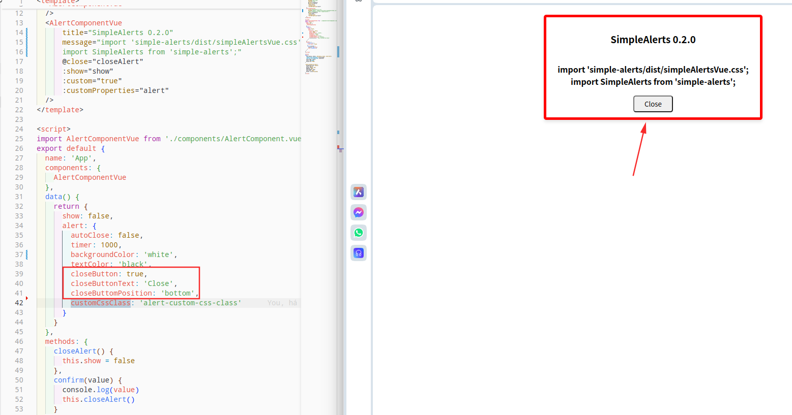

# Simple-Alerts

Simple-Alerts is a Vue alert component library that allows you to easily display customizable alerts in your Vue applications.

### Installation

To install Simple-Alerts, you can use npm or yarn:

```
npm install simple-alerts
```

### Usage
#### AlertComponent
The **AlertComponent** is the main component provided by the Simple-Alerts library. It allows you to display alerts with customizable properties.

### Props
- **title** (String): The title of the alert.
- **message** (String): The message to be displayed in the alert.
- **show** (AlertComponent.vue:55:9-71:10) (Boolean): Controls the visibility of the alert.
- **custom** (Boolean): Indicates whether custom properties should be applied.
- **customProperties** (Object): An object containing custom properties for the alert.

### Examples
##### Import vue component and css


Gif:

Video:
[SimpleAlert.webm](https://github.com/SoderJuliano/SimpleAlertsVue/assets/16232185/89ed2baf-d39f-44ec-90eb-225493b4caf3)


#### Customize options


#### Customize css


#### Full code as text exempple
```
<template>
  <AlertComponent
    :show="show"
    title="Title"
    message="Test text"
    :custom="true"
    :customProperties="alert"
  />
</template>

<script>
import AlertComponent from 'simple-alerts';

export default {
  name: 'App',
  components: {
    AlertComponent
  },
  data() {
    return {
      show: true,
      alert: {
        autoClose: true,
        timer: 1000,
        backgroundColor: 'red',
        textColor: 'white',
        closeButton: false,
        closeButtonText: 'Close',
        customCssClass: 'alert-custom-css-class'
      }
    }
  }
}
</script>
```

### Customization
You can customize the styles of the alerts by modifying the CSS classes defined in the **AlertComponent.vue** file.

### CSS Classes
- main-alert: Styles the main container of the alert.
- inner-alert: Styles the inner content of the alert.
- show: Controls the appearance of the alert when shown.
- hide: Controls the appearance of the alert when hidden.
- close-button: Styles the close button of the alert.

### License
This project is licensed under the MIT License - see the LICENSE file for details.

----------------------------------
## Update 0.1.9 changelogs

### Add a confirm option
* Now we can send a confirmatio poup-up just setting some props as we see below


Also the feedbacks of buttons interactions are true and false:
 - CANCEL = FALSE
 - COMFIRM = TRUE


## Update 0.2.0 changelogs

### BUGFIX

* Now the text color passsed by props on customProperties.textColor its set as !important and in the right place

### Option to reposition custom close button

* Now we can put the close button from right-top to the bottom


## Default vue installation doc

### Project setup

```
npm install
```

### Compiles and hot-reloads for development

```
npm run serve
```

### Compiles and minifies for production

```
npm run build
```

### Lints and fixes files

```
npm run lint
```

### Releases

0.1.9

https://github.com/SoderJuliano/SimpleAlertsVue/releases/tag/0.1.9


0.3.9

* Now you can import a direct js file fire the alert with no needed insert the SimpleAlert component into your html code;
  - Import as ``` import { showAlert } from 'simple-alerts/dist/showAlert.js' ```
  - run as ``` showAlert("hello word") ````


### Customize configuration

See [Configuration Reference](https://cli.vuejs.org/config/).

## For deploy new versions

* npm version patch // for bug fixes
* npm version minor // for simple new features
* npm version major // for features that do not have compatibility whith previous code

## Deploy on npm

* npm login
* manually update version or build may update itself
* npm run build:npm
* npm publish
